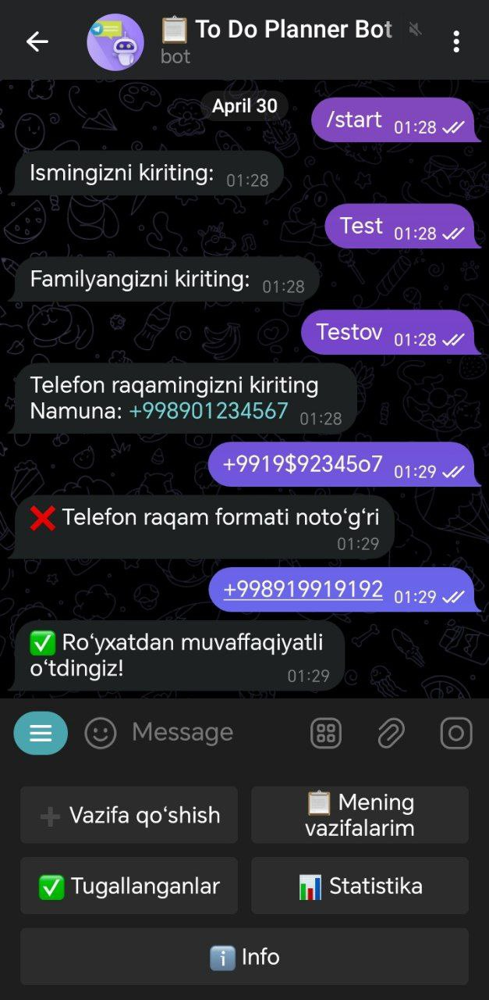
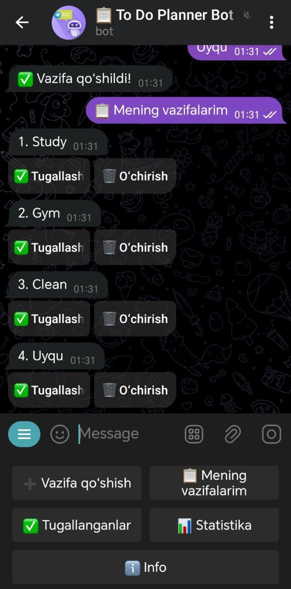
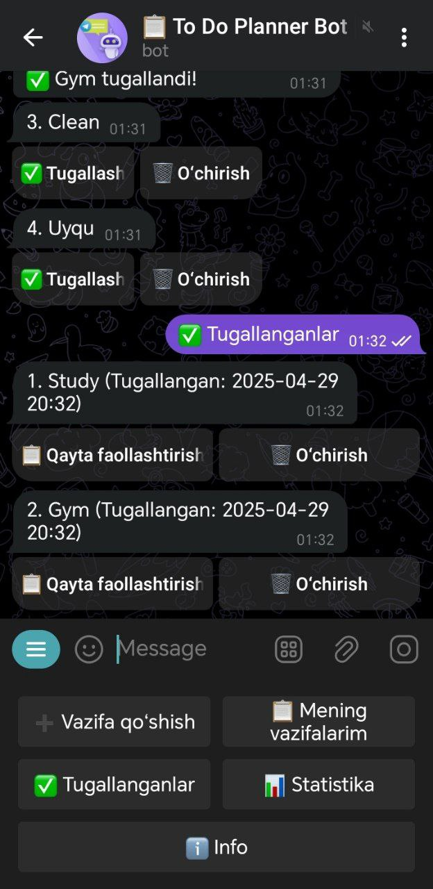

# 📋 PlanDoBot - Simple To Do List Bot

@PlanDoBot — Telegram’da vazifalarni boshqarish uchun qulay va samarali bot. Vazifalarni qo‘shing, holatini o‘zgartiring va statistikani kuzating. Bu bot kundalik rejalaringizni tartibga solishga yordam beradi! 📋✅

## ⚙️ Texnologiyalar

- Framework: aiogram (Telegram Bot API uchun Python kutubxonasi) 🚀
- Ma'lumotlar bazasi: PostgreSQL, Prisma ORM yordamida 🗃
- Holatlar boshqaruvi: aiogram FSM (Finite State Machine)
- Interfeys: Inline tugmalar va ReplyKeyboardMarkup 💻
- Validatsiya: Telefon raqamlari uchun re moduli bilan regex

## 📦 Asosiy funksiyalar

- ➕ Vazifa qo‘shish: Tez va oson yangi vazifa kiritish.
- 📋 Faol vazifalar: Inline tugmalar (✅ Tugallash, 🗑 O‘chirish) bilan ro‘yxat.
- ✅ Tugallanganlar: Tugallangan vazifalarni ko‘rish va qayta faollashtirish.
- 📊 Statistika: Umumiy, faol va tugallangan vazifalar sonini ko‘rsatish.
- ℹ️ Ma'lumot: Bot funksiyalari haqida qisqacha ko‘rsatma.

### 🔐 Ro‘yxatdan o‘tish
- Foydalanuvchilar /start buyrug‘i bilan ro‘yxatdan o‘tadi.
- Ism, familiya va telefon raqami kiritiladi.

### 🚀 Kelajakdagi Yaxshilanishlar
- 📅 Muddat qo‘shish: Vazifalarga muddat (deadline) qo‘shish.
- 🔔 Eslatmalar: Muddat yaqinlashganda xabar yuborish.
- ✏️ Tahrirlash: Vazifa sarlavhasini o‘zgartirish.
- 📍 Paginatsiya: Ko‘p vazifalar uchun “Oldingi/Keyingi” tugmalari.

## 📷 Bot ishlash strukturasidan lavhalar:

<div style="display: flex; gap: 20px;">
  
  
  
  
  
</div>

## 🚀 Ishga tushirish

### 1. Repository-ni klonlash:
### Backend
```bash
git clone https://github.com/SafarovSardorDev/simple_to_do_list_bot.git
cd simple_to_do_list_bot
```
### 2. Virtual muhit va kutubxonalarni o‘rnatish:
```bash
python -m venv venv
source venv/bin/activate  # Windows: venv\Scripts\activate
pip install -r requirements.txt
```
### 3. Muhit o‘zgaruvchilarini sozlash:
.env faylini yarating .env.dist namunasida!

### 4. Prisma migratsiyasi:
```bash
npx prisma migrate dev
```
### Botni ishga tushirish:
```bash
python app.py
```
### Botni sinash:
- Telegramda [To Do Planner Bot](https://t.me/PlanDoBot) ga o‘ting va /start buyrug‘ini yuboring. 🧑‍💻

## 👤 Muallif
Created by Sardor ✨
Telegram: [@imsafarov](https://t.me/imsafarov)

🌟 Qiziqarli loyihalar! [Python Core OOP](https://t.me/python_core_oop) kanalimizda bundanda qiziq va ajoyib open-source kodlar va projectlar mavjud. Jamoamizga qo‘shiling! Yulduzcha bosib ketish esdan chiqmasina 😁

###📜 Litsenziya
This project is licensed under the MIT License - see the LICENSE file for details. 📝

Copyright (c) 2025 Sardor
